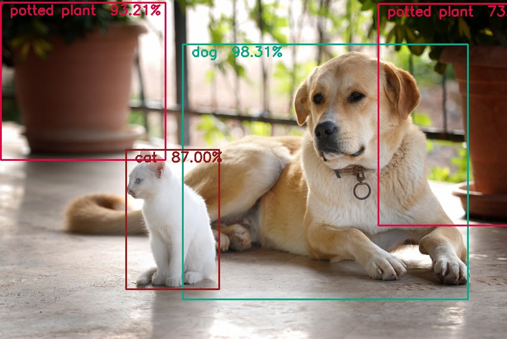
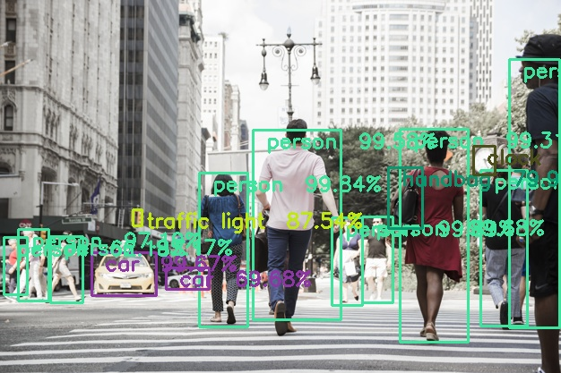
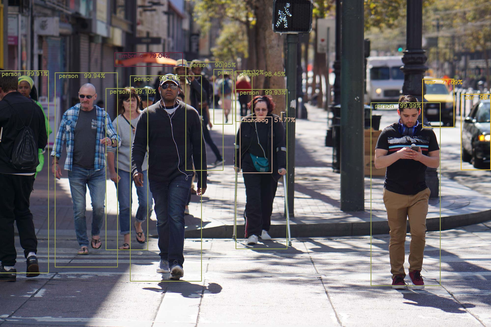

# Yolov3-Object-Detection
An object detector was built upon the YOLOv3 algorithm, an efficient algorithm 
for object detection in real-time.  
 
A pre-trained model was used using Opencv and Darknet architecture.  
 
Capable of detecting up to 80 classes in the MS-COCO 
dataset.

## Output Images
|||
|---|---|
|||
|||
